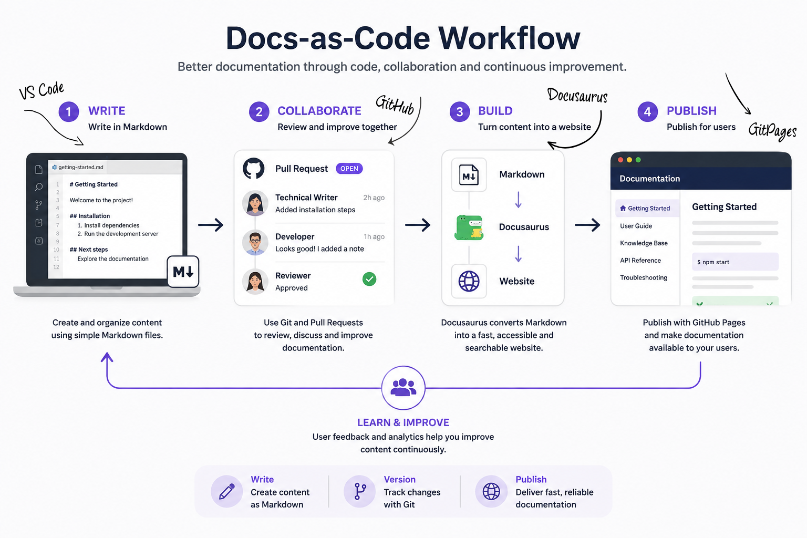

Docs-as-code is a method where documentation is written and managed in the same way that developers manage their code. It means using simple text files (such as Markdown), storing and collaborating in a version control system (such as Git), and automating the publishing process.

## **How it works**

- You write in Markdown (instead of Word or similar tools)
- You use a Markdown editor, such as VS Code
- The files are stored in a Git repository
- You build the site using a static site generator (SSG), such as Docusaurus
- The site is published using a service such as GitHub Pages
- You collaborate with colleagues and developers through a standard publishing workflow

>**Documentation becomes part of the workflow, instead of a separate activity.** 

## Using Static site generators

A static site generator (SSG) works differently from a traditional WYSIWYG editor. Instead of drag-and-drop, and using modules to build the page, you write structured content in Markdown. CSS is used to control the overall styling and visual appearance. 

Content can be reused, tracked in version control, and reviewed as part of a structured workflow. The result is a more efficient and flexible way of creating and maintaining technical documentation.

## **VS Code makes Markdown a walk in the park**

- VS Code is the perfect tool för learning Markdown.
- In VS Code, you are forced to write the actual Markdown code using your keyboard. This helps you quickly build the basics into muscle memory.
- In the VS Code preview, you can see the final result as you work.

## In collaboration with developers and technicians

One of the main strengths of GitHub and Docs-as-Code is that documentation can be developed in the same environment and using similar workflows as source code. This makes collaboration between technical writers, developers and technicians easier and more transparent.

Instead of sending documents back and forth by email or using separate review processes, everyone can work with the same files, the same version history, and the same workflow.

### One common source of information

With a Docs-as-Code workflow, documentation becomes part of the development process.

This reduces the risk of documentation becoming outdated and creates a natural connection between software development and end-user information.

### Version history and traceability

Since all changes are stored in Git, there is always a complete history of:

* what was changed
* who made the change
* when the change was made
* why the decision was made

For a Technical Writer, this means that the role is not only about creating documentation. It also means becoming an active part of the team's development workflow.

See **Learnings** to read more about how I arrived at the tools I chose. [Learnings](./05-learnings.md)

Keen on trying for yourself? Here's my hands-on-guide: [Getting started with Docusaurus](./02-gettingstartedguide.md).