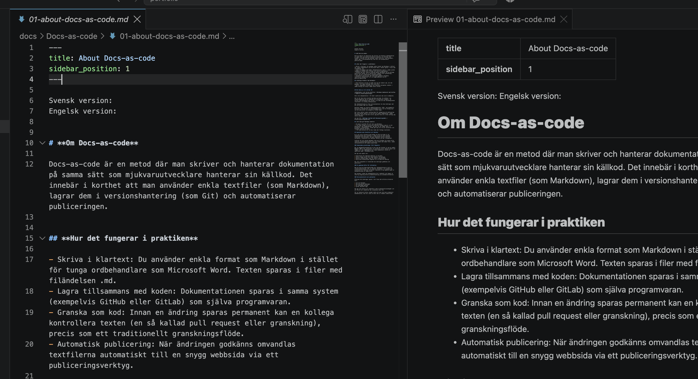

Svensk version: 
Engelsk version: 

# **Om Docs-as-code**

Docs-as-code är en metod där man skriver och hanterar dokumentation på samma sätt som mjukvaruutvecklare hanterar sin källkod. Det innebär i korthet att man använder enkla textfiler (som Markdown), lagrar dem i versionshantering (som Git) och automatiserar publiceringen.

## **Hur det fungerar i praktiken**

- Skriva i klartext: Du använder enkla format som Markdown i stället för tunga ordbehandlare som Microsoft Word. Texten sparas i filer med filändelsen .md.
- Lagra tillsammans med koden: Dokumentationen sparas i samma system (exempelvis GitHub eller GitLab) som själva programvaran.
- Granska som kod: Innan en ändring sparas permanent kan en kollega kontrollera texten (en så kallad pull request eller granskning), precis som ett traditionellt granskningsflöde.
- Automatisk publicering: När ändringen godkänns omvandlas textfilerna automatiskt till en snygg webbsida via ett publiceringsverktyg.

## **Viktiga fördelar med metoden**

- Full historik: Du kan se exakt vem som har ändrat vad, när det gjordes, och ångra misstag (tack vare Git).
- Bättre samarbete: Utvecklare och tekniska skribenter arbetar i samma verktyg och följer samma fasta rutiner.

## Det bästa av två världar ##

**Enkelheten i att skriva textfiler i Markdown kombinerat med kraften i moderna utvecklingsverktyg**

Skriv din dokumentation i VS Code – publicera den som en webbplats.

Det är här den stora styrkan med Docs-as-Code. Du arbetar i en utvecklingsmiljö som är anpassad för strukturerat innehåll. Du skriver dina Markdown-filer direkt i VS Code och kan förhandsgranska resultatet i en smidig arbetsprocess.

När dokumentationen är klar versionshanterar du dina ändringar med Git och pushar dem till GitHub. 

Därefter bygger en statisk webbplatsgenerator (SSG), som exempelvis Docusaurus, automatiskt om dina Markdown-filer till en färdig sajt som kan publiceras via exempelvis GitHub Pages.

Det finns såklart andra verktyg både för redigering och publicering men jag htycker detta är en en bra och stabil kombination. (Under Learnings) kan du läsa mer om hur jag kom fram till vilka verktyg jag skulle använda.

Läs mer här: [Gettings started with Docusaurus-guide](./02-gettingstartedguide.md).

## **VS Code gör Markdown enkelt**

- VS Code är perfekt för att lära sig Markdown.
- I VS Code tvingas du skriva de faktiska tecknen (som #, ** och parenteser) med tangentbordet. Det gör att du snabbt nöter in grunderna i muskelminnet, vilket gör dig till en mer universell och flexibel teknisk skribent.
- I VS Code preview ser du hela tiden det färdiga resultatet.

## Samarbete med utvecklare och tekniker

En av de stora styrkorna med GitHub och Docs-as-Code är att dokumentationen kan utvecklas i samma miljö och med liknande arbetssätt som källkoden. Det gör samarbetet mellan tekniska skribenter, utvecklare och tekniker enklare och mer transparent.

Istället för att skicka dokument fram och tillbaka via e-post eller separata granskningsprocesser kan alla arbeta med samma filer, samma versionshistorik och samma arbetsflöde.

### Gemensamma granskningar (Pull Requests)

När en dokumentationsändring är klar kan den skickas in som en **Pull Request (PR)** för granskning. En utvecklare eller teknisk expert kan läggas till som **Reviewer** och lämna kommentarer direkt på specifika rader i Markdown-filen.

Det gör det enkelt att:

* kontrollera att tekniska detaljer är korrekta
* ställa frågor direkt där något behöver förtydligas
* föreslå förbättringar utan att ändra originaltexten
* följa hela diskussionen kopplad till en specifik ändring

När alla synpunkter är hanterade kan ändringen godkännas och publiceras.

### En gemensam källa för information

Med ett Docs-as-Code-arbetsflöde blir dokumentationen en del av utvecklingsprocessen. När en funktion förändras i en produkt kan utvecklare och tekniska skribenter samarbeta kring uppdateringen av dokumentationen på samma plats.

Det minskar risken att dokumentation blir inaktuell och skapar en naturlig koppling mellan produktutveckling och användarinformation.

### Versionshistorik och spårbarhet

Eftersom alla ändringar sparas i Git finns det alltid en historik över:

* vad som ändrades
* vem som gjorde ändringen
* när ändringen gjordes
* varför beslutet togs

Det gör det enklare att underhålla större dokumentationsmängder och att förstå hur innehållet har utvecklats över tid.

För en Technical Writer innebär detta att man inte bara producerar dokumentation, man blir även en aktiv del av teamets arbetsflöde.

