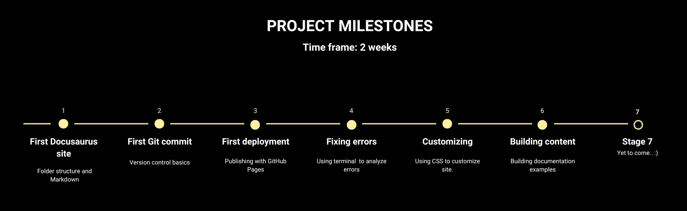

# Learnings

> The project has taught me that troubleshooting is an essential part of learning.
Once I understood how the different tools fit together, the technology itself became much less intimidating.

## Finding the right working environment

One of the first challenges was finding an environment that suited my way of working.

I initially started the project using GitHub Codespaces because it provided a ready-to-use cloud environment without requiring a complex local setup. This was a valuable learning experience and helped me understand the relationship between the editor, the terminal, a repository and a running website.

However, I experienced some challenges with the stability in the cloud environment. Troubleshooting connection issues, rebuilding Docusaurus, and managing broken sessions became a distraction from the actual documentation work.

I decided to move the project to a local setup using Visual Studio Code. This gave me a more stable and predictable workflow while still keeping the advantages of Docs-as-Code: writing in Markdown, version control with Git, and publishing through a static site generator (Docusaurus).

Finding an environment where I could work efficiently was an important part of the learning process.

Understanding the relationship between the editor and GitHub repository took some time, but eventually became part of my normal workflow.

### Understanding the concept

Another challenge was understanding how a Docusaurus project is organised. Where the important files are located, what you can do and what you should stay away from...

Instead of editing pages through a visual interface (like Wordpress), I needed to understand the project structure, how to use the terminal, create Markdown files, learn about configuration files and how they all work together. I also had understand the push/pull concept and how to be able to work from different computers. 

Version control with Git was another new concept. As the project progressed, committing changes to GitHub became a natural habit and helped me work more confidently, knowing I could always return to an earlier version if needed.

### Troubleshooting 

Rather than following a fixed tutorial, I chose to solve each problem as it appeared. Looking back, these challenges became some of the most valuable learning experiences of the project.

Several technical issues appeared throughout the project.
Solving them patiently improved my understanding of how the different tools interact.

## Responsive design – a reflection

## Responsive design in Docusaurus

When I built my site in Docusaurus, I was surprised by how little work was needed to make it responsive. The layout automatically adapts to different screen sizes and works well on desktop, tablet and mobile.

Compared with a modern WordPress theme, however, Docusaurus offers less ready-made visual flexibility. WordPress gives you many options to adjust layouts, images and design elements, while Docusaurus focuses more on content, structure and readability.

For me, this meant thinking less about visual design and more about how the content was structured and presented. 

My conclusion is that Docusaurus works very well for content-driven websites and documentation, while WordPress offers more freedom for visually complex websites.

### AI as a learning partner

AI played an important role throughout the project — not by writing everything for me, but by helping me understand unfamiliar concepts, troubleshoot errors, explore different approaches, and explain technical terminology.

The experience reinforced the importance of asking good questions, verifying information and use AI with caution. 
